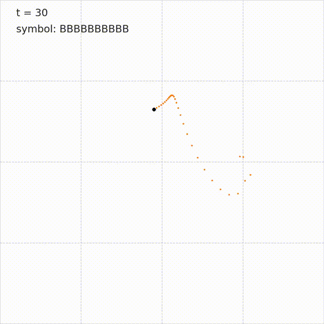

# Overview
Python scripts for [*Designing spontaneous behavioral switching via chaotic itinerancy*](https://advances.sciencemag.org/content/6/46/eabb3989).

```bibtex
@article{inoue2020designing,
  title={Designing spontaneous behavioral switching via chaotic itinerancy},
  author={Inoue, Katsuma and Nakajima, Kohei and Kuniyoshi, Yasuo},
  journal={Science advances},
  volume={6},
  number={46},
  pages={eabb3989},
  year={2020},
  publisher={American Association for the Advancement of Science}
}
```
- Step 2



- Step 3


# Installation
Please use an [Anaconda](https://www.anaconda.com/) environment to run the scripts. We recommend using [pyenv](https://github.com/pyenv/pyenv) and [pipenv](https://github.com/pypa/pipenv) to construct the python environment. If you prefer to use your own Anaconda environment, please install packages listed on `Pipfile` via `pip` or `conda`.


The following commands construct the virtualenv:
```shell
pyenv install anaconda3-2020.02
conda install -c conda-forge pipenv
pipenv --python=$(conda run which python) --site-packages
pipenv install
```

Then, spawn a new shell on the virtualenv by the following commands:
```shell
pipenv shell
```

Below, run the commands on the virtualenv.

# Usage

## Preparation
### Step 0. Initializing network
```shell
python src/script/create_network.py --output_dir ../output
```
By default, this creates a 1500-node echo state network (ESN) composed of *input ESN* (500 nodes) and *chaotic ESN* (1000 nodes). The network parameters will be stored on `{output_dir}/init` (e.g., `../output/init` in this case)

## Training
### Step 1-a. Innate training
```shell
python src/script/train_network.py --symbol_dim 3 --innate_period 1000 --innate_rate 0.5
```
Here, half of the internal weights (set by `--innate_rate 0.5`) of the echo state network are tuned with [*innate training*](https://www.ncbi.nlm.nih.gov/pmc/articles/PMC3753043/) algorithm for three symbol inputs (set by `--symbol_dim 3`). The network is optimized to output *innate trajectories* for 1000 ms (set by `--innate_period 1000`) every after the symbol switching. The tuned parameters will be stored on `../output/{symbol_dim},{innate_period},{innate_rate}` (e.g., `../output/3,1000,0.50`).

### Step 1-b. Tuning readout parameters
```shell
python src/script/train_readout.py ../output/3,1000,0.50 --func_dim 3 --func_period 1000
```
Here, the readout is optimized to output three Lissajous curves (set `--func_dim 3`) for 1000 ms (set by `--func_period 1000`) every after symbol switching. The readout parameter will be stored on `{load_dir}/readout,{func_period}` (e.g., `../output/3,1000.0,0.50/readout,1000`).

### Steps 2 and 3. Training of linear feedback loop
#### Step 2
```shell
python src/script/train_feedback.py ../output/3,1000,0.50 --symbol_dim 3 --prob_pattern cyclic --switch_period 1000
```
The linear feedback is tuned to generate periodic symbolic transition switching every about 1000 ms. The readout parameter will be saved on `{load_dir}/cyclic,{symbol_list},{switch_period}` (e.g., `../output/3,1000,0.50/cyclic,0-1-2,1000`).

#### Step 3

```shell
python src/script/train_feedback.py ../output/3,1000,0.50 --symbol_dim 3 --prob_pattern uniform --switch_period 3000
```
Here, the linear feedback is tuned to generate stochastic symbolic transition *uniformly* switching every about 3000 ms (we prepared three stochastic options. `uniform`, `branched`, and `history-dependent`). The readout parameter will be saved on `{load_dir}/{prob_pattern},{switch_period}` (e.g., `../output/3,1000.0,0.50/uniform,3000`).


## Evaluation and visualization
```shell
python src/script/record_dynamics.py ../output/3,1000,0.50 --eval_period 50000
```
This script samples the all dynamics generated by the network for 50000 ms (set by `--eval_period 50000`). The recorded dynamics will be stored on `{load_dir}/record/[DATA]/record.pkl` (e.g., `../output/3,1000,0.50/record/[DATE]/record.pkl`).

```shell
python src/script/create_animation.py ../output/3,1000,0.50
```
Based on the record `record.pkl`, this script visualizes the recorded dynamics and outputs `mp4` movies on `[DIR_TO_PKL_FILE]` (e.g., `../output/3,1000,0.50/[DATE]`).
